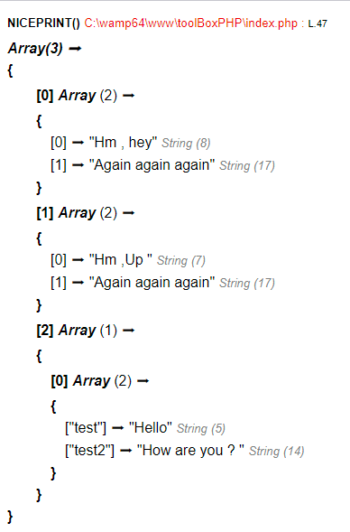
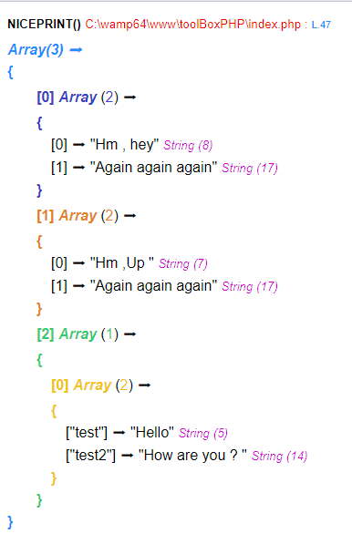

# ToolBox PHP

Here you find some little tools for make your PHP way more easier

## Installation

Nothing really hard but you need to do some little things

- Open your PHP root file ( For example mine is : C:\wamp64\bin\php\php7.3.33 ) create a new directory a name it "toolBoxPHP"
- Copy the file 'toolBox.php' inside
- Go to php.ini and modify this ligne :  "auto_prepend_file=" to "auto_prepend_file='YOURPATH'" ( Mine is : "auto_prepend_file='C:\wamp64\bin\php\php7.3.33\toolBoxPHP\toolBox.php'"
- Enjoy your life 🎉🎉


## List of functions

### nicePrint()
A nice mix with "var_dump" and "print_r functions" working with Array/String/Object (multidimentionnal too ) 
#### Usage
##### Simple

```php
// make datas
$myArray = array(
    array(
        0=> 'Hm , hey',
        1 => 'Again again again'
    ),
    array(
        0=> 'Hm ,Up ',
        1 => 'Again again again'
    ),
    array(
        0=> array(
        'test' => 'Hello',
        'test2' => 'How are you ? '
        )
    )
); 

// call the function with no flag
nicePrint($yourVariable)

```
###### Output

##### With nice colors

```php
//make datas
$object2 = new stdClass();
$object2->ingredient = "sucre";
$object2->cook = "30mn";

$fruits = array('banana','strawberry','apple',$object2);

$object = new stdClass();
$object->propriete1 = "test";
$object->propriete2 = $fruits;

// call the function with the 'color' to true 
nicePrint($yourVariable,true)

```
###### Output


## Contributing
Pull requests are welcome. For major changes, please open an issue first to discuss what you would like to change.

Please make sure to update tests as appropriate.

